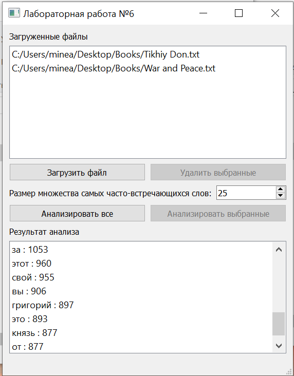

# Поиск множества самых часто встречающихся слов в .txt файлах

_Работает в многопоточном режиме_

## Технологии
- mystem.exe - утилита для морфологического анализа текста 
- QT - фронтенд для клиента

## Скриншот
